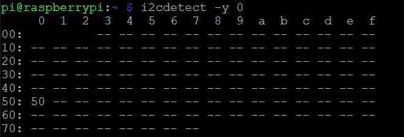

# Updating the CTRL HAT EEPROM

Check the EEPROM is reachable.

```
i2cdetect -y 0
```

You should see a grid showing 0x50 like below.

<p align="center">
    
</p>

If you get an error, make sure I2C bus 0 is enabled in `/boot/config.txt`.

```
sudo sh -c "echo 'dtparam=i2c_vc=on' >> /boot/config.txt"
sudo reboot
```

Install EEPROM utilities.

```
sudo svn checkout https://github.com/raspberrypi/hats/trunk/eepromutils
cd eepromutils
sudo make
```

## Write the Complied Configuration File

```
sudo wget https://github.com/plasmadancom/CTRL-HAT/raw/master/eeprom/ctrl-hat.eep
```

Short the CFG pin to ground on your CTRL HAT to disable write protection, then write to EEPROM.

```
sudo ./eepflash.sh -w -t=24c32 -f=ctrl-hat.eep
```

## Compile the Configuration File Yourself

```
sudo wget https://github.com/plasmadancom/CTRL-HAT/raw/master/eeprom/ctrl-hat.txt
```

Make your desired changes to ctrl-hat.txt and complile.

```
sudo ./eepmake ctrl-hat.txt ctrl-hat.eep
```

Write to EEPROM.

```
sudo ./eepflash.sh -w -t=24c32 -f=ctrl-hat.eep
```

## Reference

[HOWTO: Raspi HAT EEPROM and device-tree](https://www.raspberrypi.org/forums/viewtopic.php?f=29&t=108134)